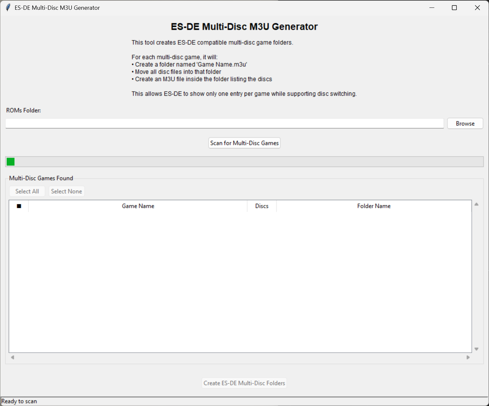

# ES-DE Multi-Disc M3U Generator

A simple GUI application that creates ES-DE compatible multi-disc game folders. This tool automatically organizes multi-disc games into the folder structure that EmulationStation-DE expects for proper disc switching support.


*Main window: Scan, select, and organize your multi-disc games for ES-DE with an easy-to-use interface.*

[](https://www.python.org/)
[](LICENSE)

## Features

- Detects multi-disc games automatically
- Lets you select which games to process (checkboxes)
- "Select All" and "Select None" buttons for easy selection
- Clean, modern GUI with status bar and auto-hiding scrollbars
- No duplicate entries in ES-DE, proper disc switching
- Works recursively through all subfolders
- No Python knowledge required for the .exe version

## What It Does

This tool creates the exact folder structure that ES-DE needs for multi-disc games. **It preserves the original subfolder structure** - M3U folders are created in the same subfolder where the multidisc games are detected.

**Before:**
```
/ROMs/
├── psx/
│   ├── Final Fantasy VII (USA) (Disc 1).chd
│   ├── Final Fantasy VII (USA) (Disc 2).chd
│   ├── Final Fantasy VII (USA) (Disc 3).chd
│   └── Single Game (USA).chd
├── psn/
│   ├── Metal Gear Solid (USA) (Disc 1).iso
│   ├── Metal Gear Solid (USA) (Disc 2).iso
│   └── Another Game (USA).iso
└── dreamcast/
    ├── Shenmue (USA) (Disc 1).gdi
    ├── Shenmue (USA) (Disc 2).gdi
    └── Single Game (USA).gdi
```

**After:**
```
/ROMs/
├── psx/
│   ├── Final Fantasy VII (USA).m3u/
│   │   ├── Final Fantasy VII (USA).m3u
│   │   ├── Final Fantasy VII (USA) (Disc 1).chd
│   │   ├── Final Fantasy VII (USA) (Disc 2).chd
│   │   └── Final Fantasy VII (USA) (Disc 3).chd
│   └── Single Game (USA).chd
├── psn/
│   ├── Metal Gear Solid (USA).m3u/
│   │   ├── Metal Gear Solid (USA).m3u
│   │   ├── Metal Gear Solid (USA) (Disc 1).iso
│   │   └── Metal Gear Solid (USA) (Disc 2).iso
│   └── Another Game (USA).iso
└── dreamcast/
    ├── Shenmue (USA).m3u/
    │   ├── Shenmue (USA).m3u
    │   ├── Shenmue (USA) (Disc 1).gdi
    │   └── Shenmue (USA) (Disc 2).gdi
    └── Single Game (USA).gdi
```

The M3U file contains:
```
Final Fantasy VII (USA) (Disc 1).chd
Final Fantasy VII (USA) (Disc 2).chd
Final Fantasy VII (USA) (Disc 3).chd
```

## Benefits

- **Single Entry**: ES-DE shows only one entry per multi-disc game
- **Disc Switching**: Proper disc selection when launching games
- **Clean Organization**: All related files are kept together
- **Automatic Detection**: Finds multi-disc games automatically
- **Simple Interface**: Easy-to-use GUI with clear feedback

## Requirements

- Python 3.4 or higher
- tkinter (included with Python)

## Installation

### Option 1: Standalone Executable (Recommended for non-technical users)
1. Download `ESDE_M3U_Generator_v1.1.0.exe` from the [Releases](https://github.com/Xplizet/esde-m3u-generator/releases) page
2. No installation required - just double-click to run!

### Option 2: Python Script
1. Clone or download this repository
2. No additional installation required - all dependencies are part of Python's standard library

## Usage

### Using the Executable:
1. Double-click `ESDE_M3U_Generator_v1.1.0.exe` to launch

### Using the Python Script:
1. Run the application:
   ```bash
   python m3u_generator.py
   ```
2. Click "Browse" to select your games folder
3. Click "Scan for Multi-Disc Games" to analyze the folder
4. **Review the found games in the list. Use the checkboxes to select which games to process.**
   - Use "Select All" or "Select None" for quick selection.
5. Click "Create ES-DE Multi-Disc Folders" to organize your games
6. **Status messages will appear at the bottom of the window.**

## File Naming Convention

The application expects multi-disc games to follow this naming pattern:
- `GameName (Region) (Disc 1).extension`
- `GameName (Region) (Disc 2).extension`
- etc.

**Examples:**
- `Chrono Cross (USA) (Disc 1).chd`
- `Chrono Cross (USA) (Disc 2).chd`
- `Final Fantasy VII (USA) (Disc 1).iso`
- `Final Fantasy VII (USA) (Disc 2).iso`
- `Final Fantasy VII (USA) (Disc 3).iso`

## Supported File Extensions

The application works with any file extension. It focuses on the filename pattern rather than specific extensions.

## How ES-DE Integration Works

ES-DE has a special feature where it can treat folders as files. When it encounters a folder named `Game Name.m3u`, it:

1. **Shows only one entry** in the game list (the folder name)
2. **Reads the M3U file** inside the folder to get the disc list
3. **Presents disc selection** when the game is launched
4. **Handles disc switching** during gameplay

This creates a much cleaner experience compared to having multiple separate entries for each disc.

## Example Output

After running the tool on a games folder with multiple subfolders:

```
/ROMs/
├── psx/
│   ├── Chrono Cross (USA).m3u/
│   │   ├── Chrono Cross (USA).m3u
│   │   ├── Chrono Cross (USA) (Disc 1).chd
│   │   └── Chrono Cross (USA) (Disc 2).chd
│   ├── Final Fantasy VII (USA).m3u/
│   │   ├── Final Fantasy VII (USA).m3u
│   │   ├── Final Fantasy VII (USA) (Disc 1).chd
│   │   ├── Final Fantasy VII (USA) (Disc 2).chd
│   │   └── Final Fantasy VII (USA) (Disc 3).chd
│   └── Single Game (USA).chd
├── psn/
│   ├── Metal Gear Solid (USA).m3u/
│   │   ├── Metal Gear Solid (USA).m3u
│   │   ├── Metal Gear Solid (USA) (Disc 1).iso
│   │   └── Metal Gear Solid (USA) (Disc 2).iso
│   └── Another Game (USA).iso
└── dreamcast/
    ├── Shenmue (USA).m3u/
    │   ├── Shenmue (USA).m3u
    │   ├── Shenmue (USA) (Disc 1).gdi
    │   └── Shenmue (USA) (Disc 2).gdi
    └── Single Game (USA).gdi
```

## Building the Executable

If you want to build your own standalone .exe:

1. Install the build dependencies:
   ```bash
   pip install -r requirements.txt
   ```
2. Run the build script:
   ```bash
   python build_exe.py
   ```
   Or use the batch file on Windows:
   ```bash
   build_exe.bat
   ```
3. The executable will be created in the `dist/` folder as `ESDE_M3U_Generator_v1.1.0.exe`

## Notes

- The application scans recursively through all subfolders
- Discs are automatically sorted by disc number
- Only files with "(Disc X)" in the name are processed
- Single-disc games are left unchanged
- The tool is safe to run multiple times (won't duplicate folders)
- The GUI features checkboxes, select all/none, and a status bar for user feedback

## Contributing

1. Fork the repository
2. Create a feature branch (`git checkout -b feature/amazing-feature`)
3. Commit your changes (`git commit -m 'Add some amazing feature'`)
4. Push to the branch (`git push origin feature/amazing-feature`)
5. Open a Pull Request

## License

This project is licensed under the MIT License - see the [LICENSE](LICENSE) file for details. 
